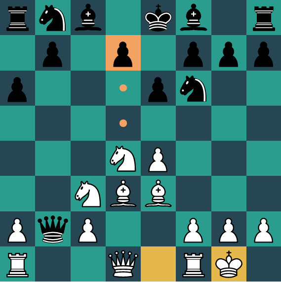

# React Chess

## TODO
* Add captured pieces ui indicator and score
* Improve page layout and UI
* Add ability to play again
* Optimize terminal nodes to use findRegicide instead of findMove
* Add an AI opponent
* Add ability to play as black or white or random and flip board